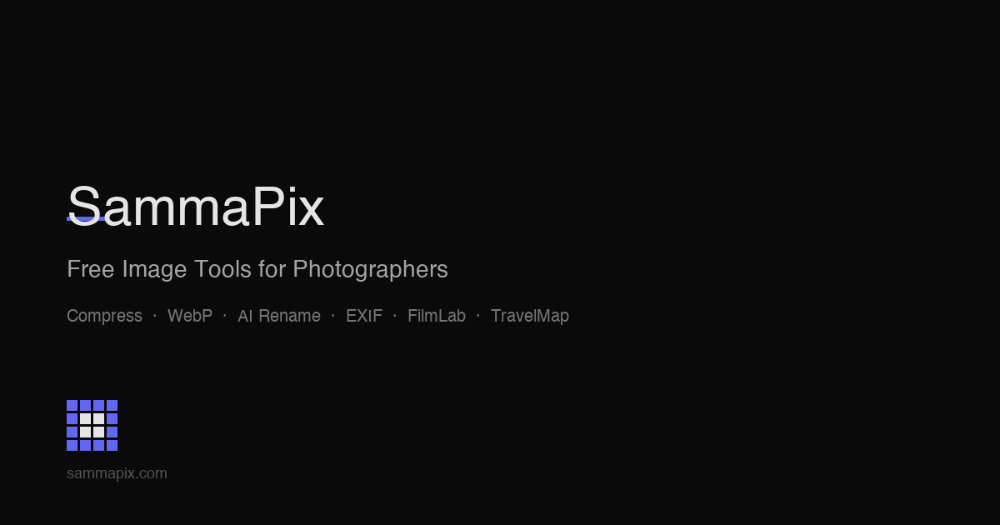

<p align="center">
  
</p>

<h1 align="center">SammaPix</h1>
<p align="center"><strong>27 free browser-based image tools — compress, convert, rename with AI, and more.</strong></p>

<p align="center">
  <a href="https://opensource.org/licenses/MIT"></a>
  <a href="https://nextjs.org"></a>
  <a href="https://typescriptlang.org"></a>
  <a href="https://www.sammapix.com"></a>
</p>

---

SammaPix is a free, open-source image optimization platform that runs entirely in the browser. No uploads. No account required. No watermarks. Your images never leave your device.

Built for content creators, developers, and anyone who works with images at scale.

**Key features:**

- 100% client-side processing — images stay on your machine
- 27 tools across four categories (optimize, AI, creative, organize)
- AI-powered rename, alt text generation, and photo sorting via Google Gemini
- Batch processing with ZIP download
- HEIC, WebP, PDF, and video format support
- Dark mode, fully responsive
- Pro plan ($9/month) for unlimited AI credits and larger batches

---

## Tools

### Optimize
| Tool | Description |
|------|-------------|
| Compress | Reduce file size without visible quality loss |
| WebP Converter | Convert JPG/PNG to WebP for faster web delivery |
| HEIC Converter | Convert iPhone HEIC photos to JPG or PNG |
| Batch Resize | Resize multiple images by pixel dimensions or percentage |
| Crop & Ratio | Crop to standard aspect ratios or custom dimensions |
| PDF to Image | Extract pages from PDF as high-quality images |

### AI-Powered
| Tool | Description |
|------|-------------|
| AI Organize | Drop 100+ photos — AI sorts them into named folders |
| AI Rename | Generate descriptive, SEO-friendly filenames automatically |
| AI Alt Text | Generate accessibility alt text for any image |
| AI Photo Sort | Sort photos by subject, scene, or custom criteria |
| Web Optimize | AI-assisted optimization for web performance |
| Transcribe | Extract text from images (OCR) |

### Creative
| Tool | Description |
|------|-------------|
| Film Filters | Apply 14 analog film presets (Kodak, Fuji, Polaroid, etc.) |
| Watermark | Add text or image watermarks with custom positioning |

### Organize
| Tool | Description |
|------|-------------|
| EXIF Viewer | Inspect full metadata — GPS, camera, exposure, timestamps |
| EXIF Remover | Strip GPS and privacy data before sharing |
| Find Duplicates | Detect duplicate images by visual similarity |
| Batch Rename | Rename files in bulk with custom patterns and sequences |
| Cull | Quickly review and select keepers from a shoot |
| Sort by Location | Group photos by GPS coordinates on an interactive map |
| Photo Map | Visualize where your photos were taken |

---

## Tech Stack

| Layer | Technology |
|-------|-----------|
| Framework | Next.js 15 (App Router) |
| Language | TypeScript 5 |
| Styling | Tailwind CSS |
| State | Zustand + Immer |
| Auth | NextAuth.js v4 (Google, GitHub, Magic Link) |
| Database | Neon (PostgreSQL) via Drizzle ORM |
| AI | Google Gemini 1.5 Flash |
| Payments | Stripe |
| Email | Resend |
| Compression | browser-image-compression |
| HEIC | heic-convert / heic2any |
| Batch download | JSZip + file-saver |
| Testing | Playwright (E2E) |

---

## Quick Start

```bash
git clone https://github.com/samma1997/sammapix.git
cd sammapix
npm install
cp .env.local.example .env.local   # fill in your keys
npm run dev
```

Open [http://localhost:3000](http://localhost:3000).

Most tools work without any API keys — only AI features require a `GEMINI_API_KEY`.

### Required environment variables

```bash
# Auth
NEXTAUTH_SECRET=
GOOGLE_CLIENT_ID=
GOOGLE_CLIENT_SECRET=

# Database
DATABASE_URL=          # Neon PostgreSQL connection string

# AI (required for AI tools only)
GEMINI_API_KEY=

# Payments (required for Pro plan only)
STRIPE_SECRET_KEY=
STRIPE_WEBHOOK_SECRET=
NEXT_PUBLIC_STRIPE_PUBLISHABLE_KEY=
STRIPE_PRO_PRICE_ID=

NEXT_PUBLIC_APP_URL=http://localhost:3000
```

---

## Privacy

All image processing tools run entirely in your browser using the Canvas API, WebAssembly, and client-side JavaScript libraries. **Your images are never uploaded to any server.**

For AI tools (AI Rename, AI Alt Text, AI Organize), a small thumbnail is sent to Google Gemini for analysis. Full-resolution originals never leave your device and are never stored anywhere.

---

## Contributing

Contributions are welcome. Please open an issue before submitting a pull request for significant changes.

1. Fork the repo
2. Create a feature branch (`git checkout -b feature/your-feature`)
3. Commit your changes
4. Open a pull request

For bug reports and feature requests, use [GitHub Issues](https://github.com/samma1997/sammapix/issues).

---

## License

MIT — see [LICENSE](./LICENSE) for details.

---

Built by [Luca Sammarco](https://lucasammarco.com) · Live at [sammapix.com](https://www.sammapix.com)
